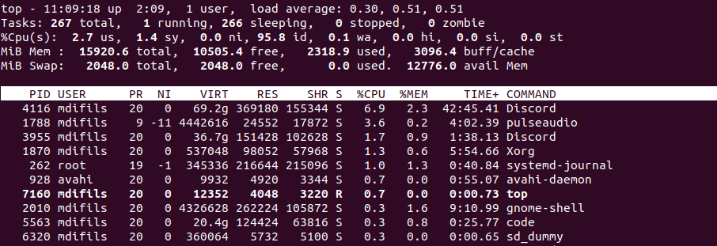
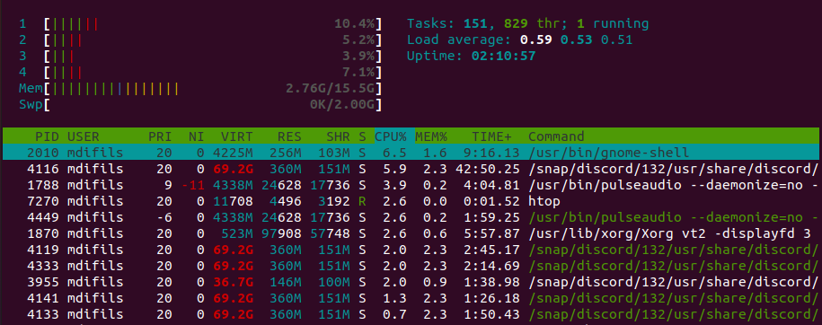
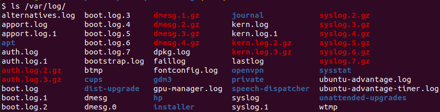
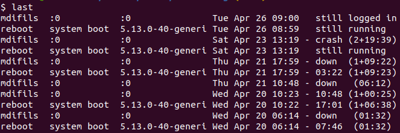
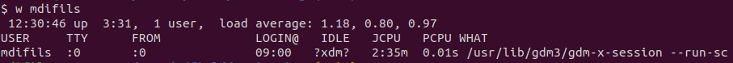
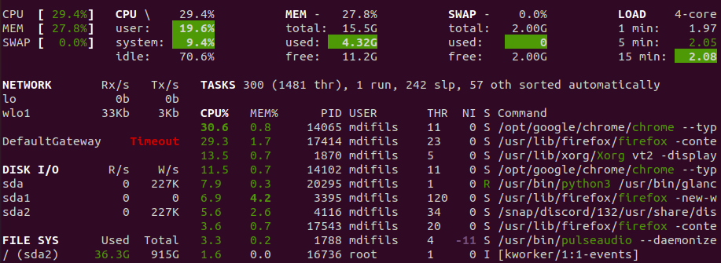
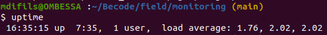
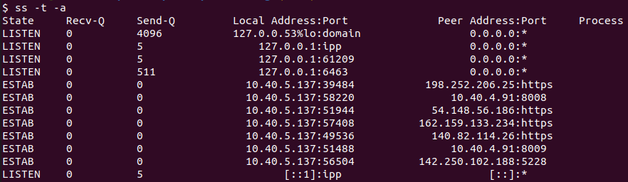

# Description

This challenge is about monitoring linux system. So I'll show you the most important responsabilities of a system administrator. So to achieve this purpose, I'll complete two tasks:

1. Task 1: researching how to monitor a linux system (summarize into a file).
2. Task 2: practicing monitoring and write a system report.

# How to monitor a linux system ?

Monitoring a system means monitoring the server performance. The server hosts
services/applications and it's really important to make sure they are available,
reliable and secure.  
The best way to tackle this question is to answer the following questions:

## What are the main area of concern when monitoring a linux system ?

Below is a non-exhaustive list of main area to monitor:

- CPU and Memory usage.
- Disk utilization.
- Running and active processes.
- Running and active disk files, network sockets and devices.
- Network traffic: incoming and outgoing packets (TCP, UDP, IP, ICMP, ...)
- Network Bandwidth utilization.
- User activity.

## How can you check the most memory intensive running tasks ?

The built-in `top` command provides a dynaminc real-time view of running system.

`htop` is an enhanced version of `top` and needs to be installed.

## What are log files and where can you find them ?

Log files are the records that Linux stores for administrators to keep track and monitor important events about the server, kernel, services, and applications running on it.

Linux provides a centralized repository of log files that can be located under the `/var/log` directory.

The log files generated in a Linux environment can typically be classified into four different categories:

- Application Logs
- Event Logs
- Service Logs
- System Logs

Check this [link](https://www.eurovps.com/blog/important-linux-log-files-you-must-be-monitoring/) to know more.

## How can you check who where the last connected users, what they did, when they left ?

Use `last` to see all users or `last <user>` for a specific user.

Use `w <user>` to see user's activity.

## What are the different health and performance metrics for linux system ?

Here are the main metrics:

- CPU usage
- RAM memory
- SWAP memory
- DISK utilization
- Network

A better alternative tool to `htop/top` is `glances`

## How can you check the uptime of a machine ?

## How can you assess the network traffic ?

